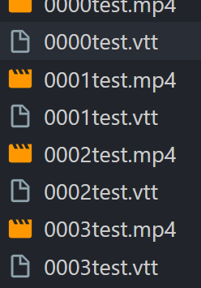
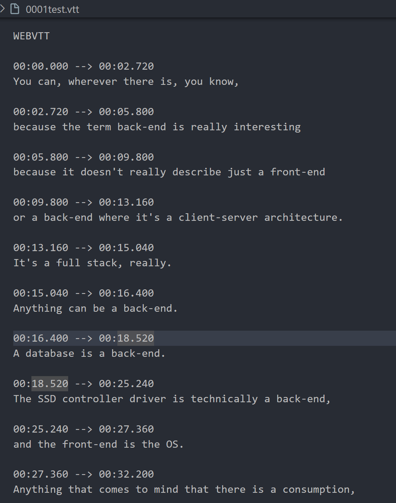

# usage

split mp4/mp3 file into small pieces with subtitles

`-f`: file path of media file mp4/mp3
`-l`: how many line in one piece of file

## whisper

[whisper](https://github.com/openai/whisper)

## ffmpeg

[FFMpeg](https://www.ffmpeg.org/)

## example

```
python sub-splitter.py -f xxx.mp4 -l 10
```

output:



